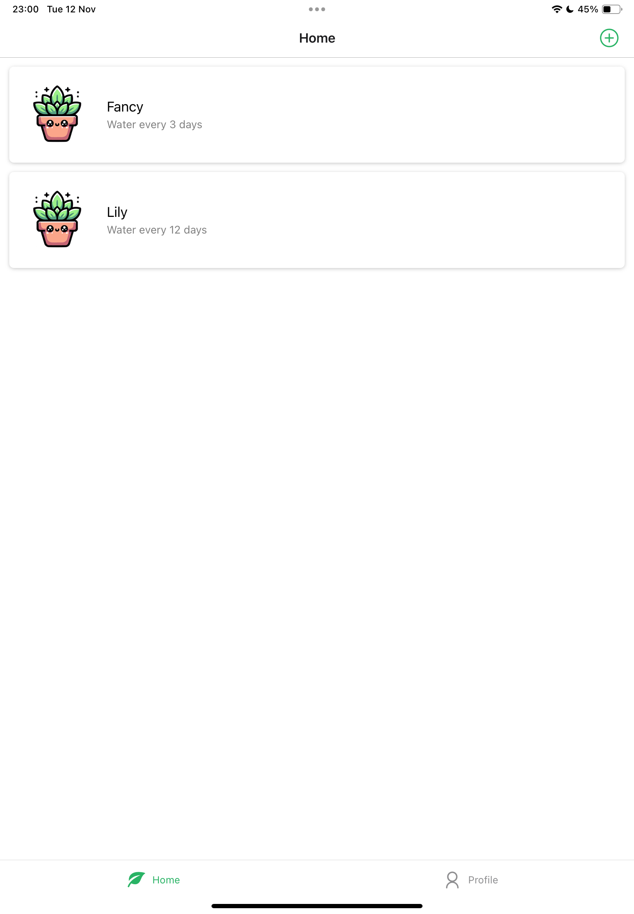

# Plantly

This is an application that reminds one to take care of their plants. It's one of the apps that I would be building for my five native apps challenge using React Native.

## Core Features of the Application

- Allows for Video uploads
- Form to add plant information
- Dynamic Routing with Tab menu

# Technologies Used

- React Native using Typescript
- Zustand for State Management

# Application UI

